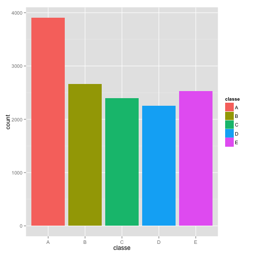
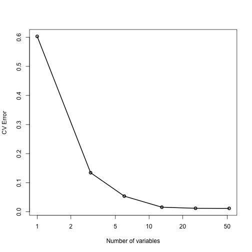
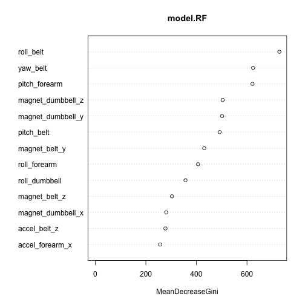

## Background

Using devices such as *Jawbone Up*, *Nike FuelBand*, and *Fitbit* it is now possible to collect a large amount of data about personal activity relatively inexpensively. These type of devices are part of the quantified self movement - a group of enthusiasts who take measurements about themselves regularly to improve their health, to find patterns in their behavior, or because they are tech geeks. One thing that people regularly do is quantify how much of a particular activity they do, but they rarely quantify how well they do it. The goal of this project is to use data from accelerometers on the belt, forearm, arm, and dumbell of 6 participants to identify when they perform barbell lifts correctly and incorrectly in 5 different ways. More information is available from the website [here](http://groupware.les.inf.puc-rio.br/har) (see the section on the Weight Lifting Exercise Dataset). 

## Data Description and Processing


```r
# Read data
dataset <- read.csv("pml-training.csv", na.strings = c("NA", "", " "))
```

The dataset consists of 19622 observations of 160 variables. From these, 7 variables contain information like the name of the user and the time when the measurements where taken. Also, 100 variables are practically useless because they contain around 19216 missing values. From this explonatory analysis, we decided to omit these 107 variables and only work with the remaining 53. It is important to mention that the variable of interest is the `classe` variable which consists of 5 levels:

- A: activity correctly performed
- B: throwing the elbows to the front
- C: lifting the dumbbell only halfway
- D: lowering the dumbbell only halfway
- E: throwing the hips to the front


```r
# Omit columns with NAs
omit.variables <- sapply(dataset, function(x) {sum(is.na(x)) > 0})
dataset <- dataset[ , !omit.variables]

# Omit first columns (no useful info)
library(dplyr)
dataset <- select(dataset, -(X:num_window))
```

## Model Training

The dataset is splitted into training and validation set using 70%-30% of the original dataset, respectively. The training set is the one that is used during model training.


```r
set.seed(12321)
library(caret)
```

```
## Warning: package 'caret' was built under R version 3.1.2
```

```r
inTrain <- createDataPartition(dataset$classe, p = 0.7, list = FALSE)
training <- dataset[inTrain, ]
validation <- dataset[-inTrain, ]
```

A quick plot on the target variable shows us its distribution.


```r
# Plot
qplot(classe, data = training, fill = classe)
```

 

For this task, we decided to use Random Forests as the model of choice. First, we trained a model using all 53 variables. 


```r
library(randomForest)
model.RF <- randomForest(classe ~ ., 
                         data = training,
                         ntree = 20)
```

Then, we perform cross-validation to determine the appropriate number of variables to consider for model training.


```r
result <- rfcv(trainx = training[ , -53], trainy = training[ , 53], ntree = 20)
with(result, plot(n.var, 
                  error.cv, 
                  log = "x", 
                  type = "o", 
                  lwd = 2, 
                  xlab = "Number of variables", 
                  ylab = "CV Error"))
```

 

From the plot above, the cross-validation error indicates that only the top 13 variables (ranked using the mean decrease in Gini coefficient) are required to produce a good model. Such variables are shown below:


```r
varImpPlot(model.RF, n.var = 13)
```

 

We re-train our model using these top variables.


```r
variables <- varImp(model.RF)
top.names <- rownames(variables)[order(variables, decreasing = TRUE)][1:13]

model.RF.top <- randomForest(x = training[ , top.names],
                             y = training$classe,
                             ntree = 20)
```

Once the model is trained, we check its performance using the validation set.


```r
pred <- predict(model.RF.top, validation)
confusionMatrix(pred, validation$classe)
```

```
## Confusion Matrix and Statistics
## 
##           Reference
## Prediction    A    B    C    D    E
##          A 1665    9    3    0    0
##          B    3 1109   14    4    3
##          C    4   14  999   14    6
##          D    2    5   10  941    2
##          E    0    2    0    5 1071
## 
## Overall Statistics
##                                           
##                Accuracy : 0.983           
##                  95% CI : (0.9794, 0.9862)
##     No Information Rate : 0.2845          
##     P-Value [Acc > NIR] : < 2.2e-16       
##                                           
##                   Kappa : 0.9785          
##  Mcnemar's Test P-Value : NA              
## 
## Statistics by Class:
## 
##                      Class: A Class: B Class: C Class: D Class: E
## Sensitivity            0.9946   0.9737   0.9737   0.9761   0.9898
## Specificity            0.9972   0.9949   0.9922   0.9961   0.9985
## Pos Pred Value         0.9928   0.9788   0.9634   0.9802   0.9935
## Neg Pred Value         0.9979   0.9937   0.9944   0.9953   0.9977
## Prevalence             0.2845   0.1935   0.1743   0.1638   0.1839
## Detection Rate         0.2829   0.1884   0.1698   0.1599   0.1820
## Detection Prevalence   0.2850   0.1925   0.1762   0.1631   0.1832
## Balanced Accuracy      0.9959   0.9843   0.9829   0.9861   0.9942
```

The trained model has an accuracy of 98.78% with a 95% confidence interval of (98.46%, 99.04%) in the validation set. The out-of-sample error is of 1.22%.

Finally, the trained model is used in a separate testing set that consists of 20 observations that were not used during the training neither validation. For these new observations, the variable `classe` was identified successfully.
